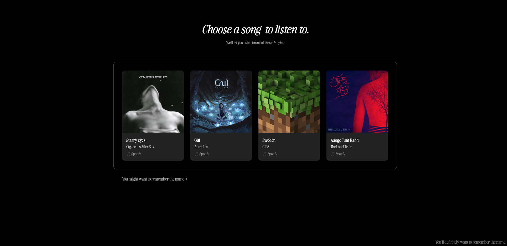
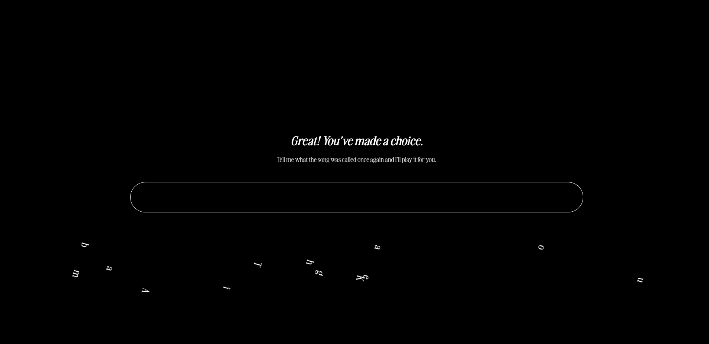
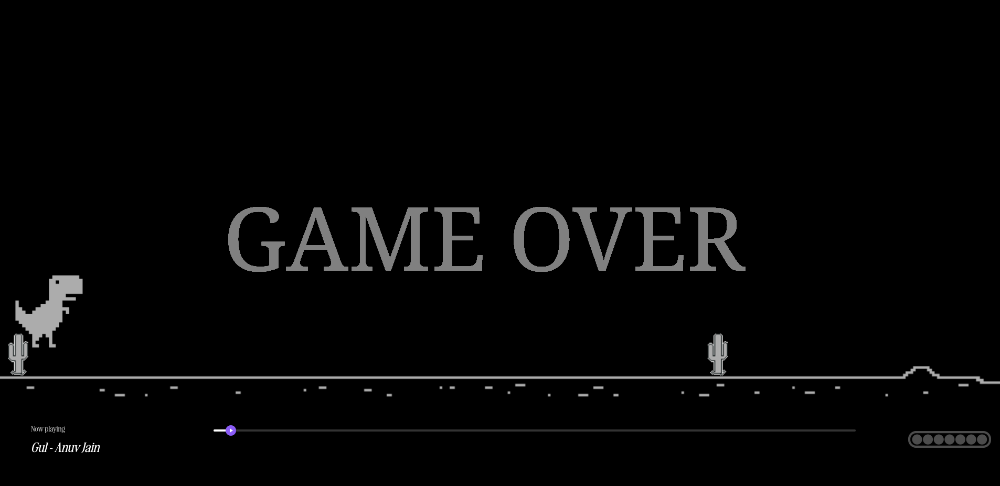
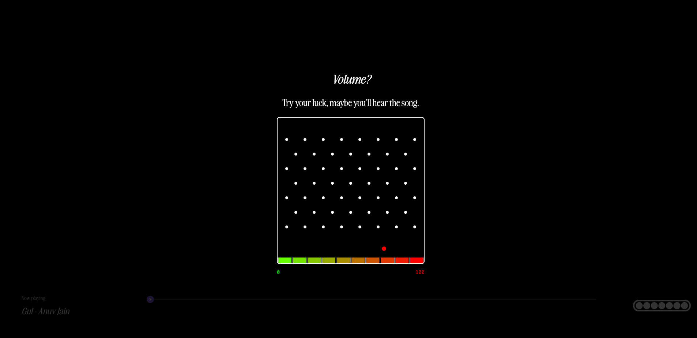

# PottaPaatt :trollface:

## Basic Details

### Team Name: **Kandam Bois**

### Team Members

* Team Lead: Adwaith Shameer– GEC Thrissur
* Member 2: Adil Haneef MK – GEC Thrissur

### Project Description

React based music player that allows you to do everything EXCEPT actually listen to music.

---

## The Problem (that doesn't exist)

People were satisfied with Spotify, Apple Music, and YouTube.
We could'nt have that. SO we built something no one would willingly use. 
And we're proud of it.

---

## The Solution (that nobody asked for)

**Potta Paatt** solves this non-problem with:

* A Dino game that controls playback (die = silence)
* A Plinko-based volume control system you’ll have a lot of fun using.
* Absolutely zero sensible UX decisions

---

## Technical Details

**Software:**

* **Languages:** JavaScript, HTML5, CSS3
* **Frameworks:** React 
* **Libraries:**`react-dnd` 
* **Build Tools:** npm


### Implementation

#### For Software:

**Installation**

```bash
git clone https://github.com/A0D1I2L3/PottaPaatt.git
cd PottaPaatt
npm install
```

**Run**
```bash
npm start
```

Now you get to listen to songs. Congrats!

---

### Project Documentation

#### Screenshots


*Landing page that looks deceptively functional.*


*Unlock a song by dragging letters into place. Why?*


*Only plays music while you’re alive in the dino game.*

*Control volume by Gambling. Good luck.*

---


## Team Contributions

* **\[Adil Haneef]** – Developer
* **\[Adwaith Shameer]** – Designer

---


---

